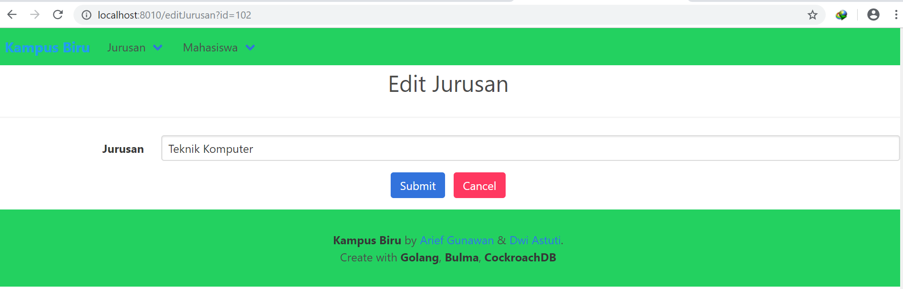

## Cara Menggunakan App

1. Download/clone dahulu driver Postgre agar CockcroachDB dapat digunakan, driver dapat didownload melalui link `` https://github.com/lib/pq`` letakan driver tersebut pada gopath yang sudah ditentukan.
   
2. Selanjutnya kita coba menjalankan DB dengan perintah ``cockroach start --insecure --listen-addr=localhost``. maka database ini telah berjalan. 
   
   

3. Untuk mengeceknnya kita dapat mengakses melalui web browser dengan mengakses ``http://localhost:8080``
   
   

4. Buka terminal pindahkan ke direktori gopath yang digunakan untuk menyimpan APP, kemudian ketikan perintah ``go run main.go``

    

Maka akan ditampilkan url server untuk app tersebut, pada gambar di atas server app berada pada ``http://localhost:8010``

5. Setelah memasukan ``http://localhost:8010`` pada web browser tampilan akan seperti di bawah ini

   

6. Akan dicoba untuk memasukan data jurusan, pertama klik menu jurusan kemudian pilih tambah jurusan 
    

    Isi data sesuai keinginan,
    

    Tampilan ketika data berhasil dimasukan 
    

7. Edit Data
   Setelah berhasil memasukan data berikutnya untuk edit data klik tombol edit di kolom paling kanan
   

   diubah nama jurusan yang semula Sistem Informasi menjadi Teknik Komputer :
   

   Maka data jurusan akan berubah untuk kode 102 yang semula Sistem Informasi berubah menjadi Teknik Komputer
   
    
8. Hapus Data
   Untuk menghapus data, tinggal klik tombol hapus di kolom paling kanan
   

   Tampilan setelah dihapus :
   

    
